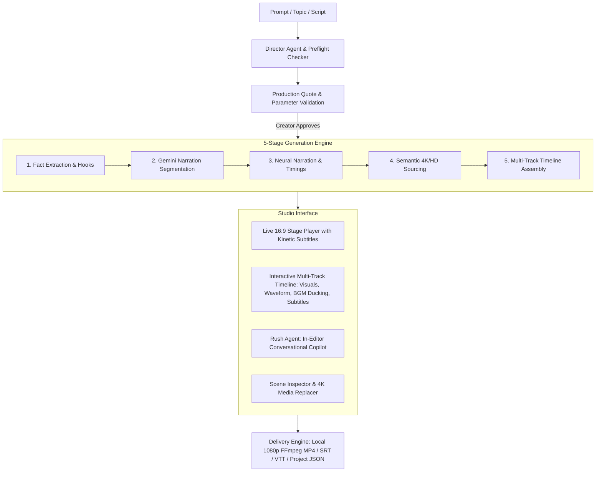

# VidRush Studio (AI Long-Form Video Production Platform)

VidRush Studio is a local AI-assisted video creation studio inspired by **VidRush (Vid.Rush)**. It automates long-form narrative planning, media retrieval and verification, timeline assembly, narration, captions, and local 1080p MP4 rendering while keeping every scene editable.

For optional post-render automation through n8n, see `N8N_PUBLISHING_SETUP.md`. The n8n bridge accepts only Gemini-verified renders and uses signed events/callbacks; it does not replace the local Gemini media-verification or FFmpeg rendering pipeline.

---

## Key Architecture & Features (VidRush Reverse Engineered)



1. **Director Agent & Preflight Quote System**:
   - Give any idea, topic, or script.
   - Evaluates narrative angles, target duration, scene beat counts, and provides a structured production quote before generation.
2. **Automated 5-Stage Pipeline**:
   - Real-time animated pipeline tracking: *1. Researching → 2. Scripting → 3. Neural Voiceover → 4. Semantic B-Roll Sourcing → 5. Multi-Track Timeline Assembly*.
   - Adaptive Gemini segmentation scales visual changes with narration runtime instead of imposing a fixed scene count; a one-minute documentary typically targets roughly 16 atomic visual units.
   - Five short query angles, cached multi-provider aggregation, multimodal embedding ranking, batched Gemini pixel verification, two recovery rounds, and optional generated-image fallback drive each scene.
   - SQLite-backed project autosave, project versions, generation jobs, and event checkpoints survive page reloads.
3. **Unified VidRush Production Studio**:
   - **Center Stage Player**: Frame-accurate 16:9 playback with live **Kinetic Subtitle Styles** (Hormozi, MrBeast, Cyberpunk Neon, Clean Minimal).
   - **Multi-Track Timeline**: Visual B-Roll clips with draggable duration trim handles, Narration Waveform Track, Background Music Ducking Track, and Subtitles Track.
   - **Scene Inspector**: Cinematography shot types, director reasoning, narration editor, and candidate switcher.
4. **Rush Agent (In-Editor Transactional Copilot)**:
   - Plain-language AI editor inside the studio:
     - *"Change scene 2 visual to ancient Roman armor"*
     - *"Make the opening hook 10x more dramatic"*
     - *"Set captions to Hormozi yellow"*
     - *"Set music volume to 20%"*
     - *"Trim scene 3 to 5s"*
5. **Local 1080p FFmpeg MP4 Render Engine**:
   - Synthesizes narration audio with ElevenLabs character timestamps or Windows SAPI fallback.
   - Downmixes background music with auto-ducking during speech.
   - Downloads and normalizes 4K/HD visual footage.
   - Aligns scene cuts and captions to actual ElevenLabs narration timing.
   - Runs a sampled Gemini QA pass on the final rendered pixels before automated publishing.
   - Delivers an instant playable MP4 preview and direct download link.
6. **Multi-Format Export Suite**:
   - 1080p MP4 Video
   - Timed Subtitles (`.SRT` and `.VTT`)
   - Project JSON Manifest (compatible with VidRush, Remotion, Premiere, DaVinci, and CapCut)
   - Dissected Production Script (`.TXT`)
   - Media Provenance & Source Attribution (`.CSV`)
   - Gemini Veo clip generation with Gemini frame verification
   - Optional custom webhook dispatcher for exported manifests

---

## Run Locally

Start the local server from your terminal:

```powershell
cd C:\Users\block\Documents\Codex\2026-08-31\do\scriptflow-studio
npm start
```

Then open `http://127.0.0.1:8080` in your web browser.

---

## AI & Stock Integrations

- **Voiceover Engines**: ElevenLabs Neural Voices (Rachel, Adam, Antoni, Josh, Bella, Arnold) + Windows SAPI.
- **AI Engines**: Google Gemini through server-side model discovery, plus optional OpenAI, local Ollama, and procedural fallbacks for non-strict workflows.
- **Stock Footage**: Pexels, Pixabay, Unsplash, Wikimedia Commons, Openverse, Gemini image/Veo generation, and custom uploads.
- **Background Music**: Ambient Documentary, Epic Cinema, Cyberpunk Synth, and Lo-Fi Chill with automatic volume ducking.
