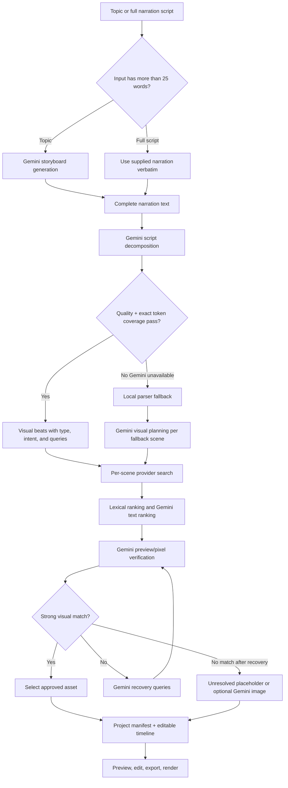
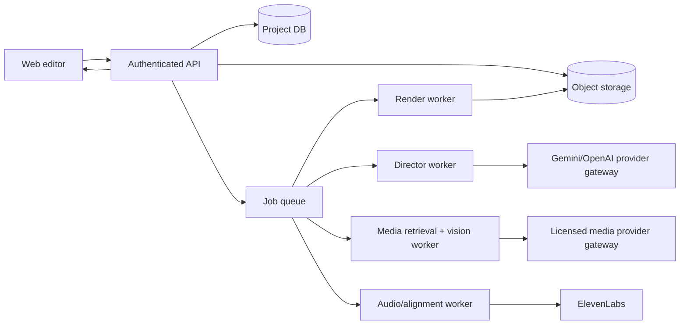

# ScriptFlow Studio: Technical Workflow Handoff

## 1. Purpose and current scope

ScriptFlow Studio is a **single-user, localhost MVP** for turning a topic or a supplied narration script into an editable video project. Its primary AI workflow is Gemini-led visual planning and stock-media selection; it then provides scene editing, caption controls, TTS, exports, and a local FFmpeg render.

It is not a multi-tenant SaaS or a persistent production backend. There is no database, user authentication, job queue, asset CDN, collaborative editing, or cloud render worker in the current implementation.

The application runs only on `127.0.0.1:8080` by default. Node.js serves the static browser UI and a small HTTP API from the same process.

## 2. Technology stack

| Layer | Current implementation |
| --- | --- |
| Frontend | Vanilla HTML, CSS, and browser JavaScript modules loaded from `index.html`; no React/Vue framework or build pipeline. |
| State management | In-memory project manifest plus transactional undo/redo store. |
| Backend | Node.js built-in `http` server in `server.js`; JSON-over-HTTP endpoints. |
| AI director | Google Gemini API through server endpoints, with optional direct browser Gemini/OpenAI/Ollama assistant paths. |
| Media sources | Pexels, Pixabay, Unsplash, Wikimedia Commons, and Openverse. |
| Visual verification | The server temporarily copies each original media file in the final search pool. It extracts a review JPEG for images and representative frames from copied videos, then Gemini answers a direct yes/no question against the exact visual brief. Only `yes` can be eligible for selection. |
| Image fallback | Gemini native image generation endpoint that stores generated images locally. |
| Generated video | Official Gemini API Veo 3.1 long-running job at 720p; stored locally and sampled into frames for Gemini verification before it can be applied. |
| Narration | ElevenLabs proxy or Windows `System.Speech` fallback. |
| Rendering | `ffmpeg-static`, invoked locally by Node. |
| Export | Browser-generated JSON, SRT, VTT, TXT, CSV; server-generated MP4. |
| n8n publishing bridge | Optional server-owned signed event/callback bridge for publishing completed Gemini-verified renders. It is not part of media selection, Gemini generation, or FFmpeg rendering. |

## 3. Runtime layout

```text
Browser UI
  ├─ ProjectManifest (canonical project data)
  ├─ ProjectStore + ProjectActions (edits, undo/redo)
  ├─ AIDirector (orchestration)
  ├─ StockAPI (media-search client)
  ├─ VoiceProvider / TTS (audio)
  ├─ Timeline / Player / Exporter (editing and output)
  └─ localStorage (settings and, currently, user-entered keys)
               │ HTTP JSON
               ▼
Local Node server: 127.0.0.1:8080
  ├─ Gemini orchestration and preview verification
  ├─ Stock-provider aggregation
  ├─ Gemini generated-asset persistence
  ├─ ElevenLabs proxy
  ├─ FFmpeg renderer
  └─ Optional custom webhook proxy
               │ HTTPS
               ▼
Gemini / ElevenLabs / Pexels / Pixabay / Unsplash /
Wikimedia Commons / Openverse / configured Flow webhook
```

Important runtime directories:

| Path | Purpose |
| --- | --- |
| `generated-assets/` | Locally saved Gemini-generated scene images. |
| `renders/<render-id>/` | Temporary/source assets, narration, subtitles, intermediate clips, MP4, and render manifest. |
| `.env`, `.env.local`, `.env.providers.local` | Local server configuration; must never be committed. |
| `js/manifest.js` | Canonical manifest schema. |
| `js/history.js` and `js/actions.js` | Project state mutations and undo/redo. |
| `js/aiDirector.js` | Main script-to-manifest workflow. |
| `js/stockApi.js` | Browser client for scene-specific media search and strict selection gate. |
| `server.js` | HTTP API, AI calls, media ranking, generation, TTS, and rendering. |

## 4. Canonical project model

`ProjectManifest` is the single source of truth for the browser application. It includes:

```json
{
  "schemaVersion": "2.0.0",
  "id": "proj_<timestamp>_<random>",
  "metadata": {
    "title": "...",
    "format": "documentary",
    "aspectRatio": "16:9 | 9:16",
    "theme": "cinematic-documentary",
    "createdAt": "ISO timestamp",
    "updatedAt": "ISO timestamp",
    "revision": 1,
    "decomposition": {
      "provider": "gemini | parser-fallback",
      "beatCount": 0,
      "completedAt": "ISO timestamp"
    }
  },
  "settings": { "fps": 30, "width": 1920, "height": 1080, "wpmTarget": 145 },
  "audio": {
    "voice": { "provider": "windows-sapi | elevenlabs", "voiceId": "...", "modelId": "..." },
    "backgroundMusic": { "enabled": true, "trackId": "...", "volume": 0.15, "ducking": true }
  },
  "captions": { "enabled": true, "style": "hormozi", "position": "bottom", "fontSize": 44 },
  "scenes": [],
  "provenance": {}
}
```

Each scene holds the exact narration chunk, its timing, Gemini’s shot direction, selected visual, alternate media candidates, and generated word timings. The relevant nested model is:

```json
{
  "id": "scene_<...>",
  "index": 1,
  "text": "Exact narration words for this visual beat.",
  "captionText": "...",
  "durationSec": 4.5,
  "startSec": 0,
  "endSec": 4.5,
  "wordTimings": [{ "word": "Exact", "startSec": 0, "endSec": 0.45 }],
  "shotDirection": {
    "visualType": "diagram",
    "visualIntent": "What the audience must literally see.",
    "shotType": "Specific framing/treatment",
    "directorReasoning": "Why that visual depicts this beat.",
    "searchQueries": ["primary literal query", "alternative query", "detail query"],
    "aiVisualPrompt": "Fallback generation prompt"
  },
  "visual": {
    "assetId": "...",
    "type": "photo | video | placeholder",
    "url": "...",
    "thumbnail": "...",
    "source": "pexels | pixabay | unsplash | wikimedia | openverse | gemini | unresolved",
    "visualVerification": {
      "previewAnalyzed": true,
      "provider": "gemini-vision",
      "eligible": true,
      "verdict": "strong-match | partial-match | reject",
      "reason": "Visible-evidence explanation"
    }
  },
  "visualCandidates": []
}
```

Every reducer mutation clones the manifest, applies a typed action, recalculates scene timings, increments revision metadata, and notifies listeners. The undo/redo history is limited to 50 in-memory snapshots. Reloading the page loses the project unless the user exports it.

## 5. End-to-end creation workflow



### 5.1 Input classification and preflight

1. The UI accepts either a short topic/prompt or a script.
2. The client uses a simple threshold: input with more than 25 words is treated as a supplied full script.
3. `/api/gemini/preflight` asks Gemini for title, hook angle, duration, and scene estimate. If that call fails, a deterministic local estimate is returned.
4. Preflight is advisory. It does not independently fact-check research claims or scrape web sources.

### 5.2 Topic-to-narration path

For a topic, `AIDirector.generateManifest` first calls `/api/gemini/generate-storyboard`. Gemini writes narration-only sections with no fixed scene count. Those sections are concatenated and sent through the same adaptive segmentation and visual-contract stages as a supplied script.

If the server call fails and Gemini is configured in the browser, an older direct browser Gemini fallback can generate the storyboard. If both fail and Gemini is not required, the server has a procedural template fallback. The fallback is intentionally available for continuity, but its generic writing/search phrases are lower quality and should not be used when the requirement is “Gemini is the mastermind.”

The generated storyboard narration is concatenated into a full script and then passes through the same decomposition workflow as a user-supplied script.

### 5.3 Gemini script segmentation

`POST /api/gemini/segment-script` receives:

```json
{
  "script": "Full narration",
  "format": "documentary",
  "theme": "cinematic-documentary",
  "apiKey": "optional client Gemini key"
}
```

Gemini must return ordered narration units with these constraints:

- Each narration word appears **once and in the original order** across the returned units.
- Each unit maps to one stock asset or generated shot. Gemini splits at clause level when one asset cannot depict the complete wording.
- Scene density is adaptive rather than capped. At roughly one minute of documentary narration, the server normally requires at least about 13 meaningful visual units and targets about 16; longer videos scale from estimated runtime.
- The opening generally changes visual ideas every 2–4 seconds and the remainder every 3–7 seconds, but maps, charts, comparisons, and continuous actions may remain longer when Gemini explains why.
- This stage returns only exact text, estimated duration, `meaningAnchor`, and `segmentationReason`; it does not choose media or write search queries.

Server validation checks exact token coverage, fragment quality, meaning anchors, and the adaptive minimum scene density. If validation fails, the server performs one Gemini quality-revision pass. If it still fails, the endpoint errors instead of accepting an under-segmented video. The client uses 3,600-character transport batches for long scripts and only uses a local parser fallback when `requireGemini` is false.

### 5.3.1 Visual-contract stage

After segmentation passes, `POST /api/gemini/plan-visuals` receives stable scene IDs in batches of at most 20. It cannot merge or rewrite those units.

Gemini builds one **atomic visual contract** per ID. A contract requires one retrievable visual idea, one to three facts a single asset can visibly prove, explicit exclusions, four or five short stock-search noun phrases, and a fallback generation prompt. The longer `visualIntent` is used for verification and generation, never as the stock query. `candidateAcceptanceTest` becomes the exact yes/no question applied to copied source-media frames. Missing contracts or vague/overlong queries fail validation and receive one repair pass.

### 5.4 Per-scene visual planning

If a scene comes from local parser fallback, or a scene is edited and replanned, `POST /api/gemini/plan-visuals` receives stable scene IDs and narration text. Gemini returns exactly one visual plan per supplied ID. The server rejects a response that does not return a usable plan for every scene.

The resulting plan drives the three-column scene table:

| Column | Data source |
| --- | --- |
| Script chunk | Exact Gemini decomposition beat, or parser fallback if Gemini was unavailable. |
| Gemini visual brief | `visualType`, `visualIntent`, `searchQueries`, framing, and rationale. |
| Selected visual | Strongly verified stock asset, manually chosen alternative, generated image, upload, or unresolved placeholder. |

## 6. Media acquisition and selection

### 6.1 Provider collection

`POST /api/media/search` takes scene context, not merely one phrase:

```json
{
  "query": "primary query",
  "searchQueries": ["exact", "synonym", "location or era", "format", "broader literal"],
  "sceneText": "Exact narration beat",
  "visualType": "diagram",
  "visualIntent": "Exact required visual",
  "filter": "all | image | video",
  "autoGenerateFallback": false
}
```

The browser forwards up to six direct Gemini queries without replacing them with narration text. The server preserves those direct angles first, adds limited compact and format-specific variants, and searches up to ten initial phrases concurrently. If Gemini finds no strong pixel match, it can run two recovery rounds with up to three new literal queries per round.

| Provider | Media |
| --- | --- |
| Pexels | Photos and videos |
| Pixabay | Photos and videos |
| Unsplash | Photos |
| Wikimedia Commons | Photos/illustrations |
| Openverse | Images |

Results are deduplicated by exact URL. The server retains provider-native title/description/tags where present plus source, creator, license metadata, query rank, and thumbnail/poster URL.

These providers are the automatic, rights-filtered acquisition layer; they are not “the whole internet.” General web search can be added only as discovery, because a discoverable URL does not prove reuse rights. See `MEDIA_RIGHTS_POLICY.md`.

For visual types that inherently require a still asset (`historical-map`, `modern-map`, `document`, `newspaper`, `diagram`, `scientific-illustration`, `chart`, `data-visualization`, `infographic`, `timeline`, `interface`), an `all` request is automatically converted to an image-only provider search. Archival scenes now search both photographs and footage. An explicit user choice of `video` remains respected.

The server keeps every provider available, but uses retrieval profiles to bias the shortlist and add format-specific query variants. For example, maps/archives/scientific diagrams prefer Wikimedia and Openverse; action footage, aerials, and animations prefer Pexels/Pixabay; chart/comparison scenes add chart/infographic terms. This is a ranking preference, not a provider exclusion.

### 6.2 Why the tomato failure occurred and the correction

The initial Pexels/Pixabay result adapters inserted the requested search query into the title/description of every returned asset. That made metadata ranking believe an unrelated tomato image had metadata matching “gravitational lensing,” even though its actual content was unrelated.

The current implementation removes those synthetic query labels. Ranking now uses actual provider metadata only. The original provider search query remains separate as retrieval context and is not treated as proof that an asset depicts the requested subject.

### 6.3 Two-stage ranking and visual verification

The server lexically pre-ranks up to 48 assets, asks Gemini to rank up to 30 provider-metadata records, and returns up to 18 reviewed candidates. Before visual verification, it copies each original candidate URL to a temporary local review folder (with a 60 MB per-file limit) and extracts image/video frames. Pixel review is split into batches of six candidates so a large pool cannot overload one Gemini multimodal request. If a batch omits a candidate or gives an invalid answer, the server retries that candidate individually. A copy failure, malformed response, or missing answer is `not-available`: it cannot be selected or counted as a Gemini rejection.

The current media logic has four steps:

1. **Lexical pre-rank** — compare genuine provider title/description/tags with the narration and Gemini query terms; apply a modest video preference only for action-oriented visual types.
2. **Gemini text rank** — Gemini receives the top 30 candidates’ real metadata and ranks literal suitability. This stage is only a shortlist; it must not approve media.
3. **Gemini pixel verification** — server creates one local review JPEG for each copied image and start/middle/end frames for each copied video, then processes candidates in six-item multimodal batches. Gemini receives the exact yes/no question for each candidate. Missing or invalid batch answers are retried individually; a candidate is never treated as `no` unless Gemini explicitly returned `no`.
4. **Strong-match gate** — Gemini must mark a preview `eligible: true` and `verdict: "strong-match"` after inspecting pixels. The browser selects only such an asset when Gemini verification is active; otherwise it creates an `unresolved` placeholder.

The visual verifier is instructed to reject explicit contradictions: for example outdoor vs indoor, daylight vs dark, leaves vs a room corner, a different animal/era, or an image when an essential action requires moving footage. The reason shown in the UI is Gemini’s visible-evidence explanation.

Multi-frame review is implemented when the provider supplies representative frames. Gemini must mark action-oriented video types (`documentary-footage`, `reenactment`, `aerial`, `screen-recording`, `animation`) as temporally confirmed before they can pass the automatic strong-match gate. This is stronger than poster-only review, but is still not full-frame video decoding or action recognition across the complete clip.

### 6.4 Recovery and generated-image fallback

If none is a strong match, the server asks Gemini for three short replacement queries, searches them, merges/deduplicates the pool, and repeats ranking and pixel verification. It may perform two recovery rounds while preserving all prior candidates and explicit rejection evidence.

If search returns no candidates at all, or every collected candidate receives an explicit Gemini `no`, and the optional `autoGenerateFallback` setting is on, `/api/gemini/generate-image` calls a Gemini image-capable model. A `not-available` verification blocks automatic generation because it is not a rejection. The generated binary is limited in size, written to `generated-assets/`, and returned as a local `/generated-assets/...` asset marked:

```json
{
  "source": "gemini",
  "generatedBy": "gemini",
  "license": "AI-generated original asset",
  "generationPrompt": "...",
  "fallbackReason": "..."
}
```

Generated images are selectable manually in the media dialog and can be placed first only when the auto-fallback option is enabled. They are not a replacement for correct stock retrieval; they are an exception path. Automatic stock selection requires a Gemini `strong-match`; when Gemini is unavailable or cannot review an asset, the scene remains `Needs Review`. The editor labels selected assets as `Gemini Verified`, `Gemini Generated`, `Manual Override`, or `Needs Review`, so a manually applied thumbnail cannot appear to be Gemini-approved.

## 7. Editing workflow

The UI reads from the manifest and applies typed actions through `ProjectActions.reduce`:

- `REPLACE_VISUAL`
- `SET_SCENE_DURATION`
- `REWRITE_SCENE_TEXT`
- `SET_CAPTION_STYLE`
- `SET_THEME`
- `SET_VOICE_CONFIG`
- `SET_BGM_CONFIG`
- `ADD_SCENE`, `REMOVE_SCENE`, `REORDER_SCENES`
- `BATCH_ACTION`, `LOAD_PROJECT`

After an action, the manifest is re-timed sequentially. Word timings are currently calculated by evenly dividing each scene duration by word count. This is suitable for a browser preview but is **not forced alignment** from actual spoken audio.

The timeline visually presents four tracks:

1. visual clip blocks;
2. narration/waveform representation;
3. background-music/ducking representation;
4. caption blocks.

It is an editor-state timeline. It is not an NLE-grade timeline with clip-level keyframes, waveform-derived sync, transitions, or arbitrary multi-track audio/video composition.

The Rush Copilot endpoint receives a snapshot of the manifest and asks Gemini to return either a conversational reply or one structured edit action. The client then passes that action through the same reducer path, so AI edits and manual edits share state validation/re-timing.

## 8. Voice, captions, and local render

### 8.1 Voice generation

- The preview can request individual scene MP3s from `/api/elevenlabs/speech`.
- The renderer concatenates the full narration text and synthesizes one complete audio file through ElevenLabs.
- If ElevenLabs fails during render, the server falls back to Windows `System.Speech.Synthesis.SpeechSynthesizer`.
- Once final narration duration is known, scene durations are proportionally scaled to fit the final audio duration.

This proportional retiming is simple and predictable but does not preserve precise sentence pauses or exact speech timestamps. A production version should derive scenes and captions from forced-alignment timestamps instead.

### 8.2 Caption behavior

The browser supports caption presets (`hormozi`, `beast`, `neon`, `minimal`), position, and enabled state. Browser playback can use the manifest’s evenly distributed word timings for an active-word effect.

The rendered MP4 uses a scene-level SRT and FFmpeg `subtitles` filter with static font/color/outline styling. The final MP4 does not yet implement true word-by-word kinetic captions, animated emphasis, or transcript alignment.

### 8.3 Rendering sequence

`POST /api/render` performs this local workflow:

1. Validate a 1–200 scene render payload, cap remote asset and audio downloads at 60 MB, and restrict generated-image paths to `generated-assets/`.
2. Synthesize narration (ElevenLabs or Windows fallback).
3. Measure narration duration with FFmpeg and retime scenes proportionally.
4. Generate `captions.srt` from scene durations.
5. Download each selected remote asset or use a local generated asset.
6. Convert every scene into a 30 FPS H.264 clip: loop images, loop videos as necessary, scale/crop to 1920×1080 or 1080×1920, and trim to scene duration.
7. Concatenate scene clips.
8. Generate a procedural ambient sine-based music bed and mix it with narration at configured volume.
9. Burn subtitles, multiplex audio/video, and write H.264/AAC MP4 with fast-start metadata.
10. Store output under `renders/<render-id>/` and return local download/manifest URLs.

The current `backgroundMusic.track` UI choice is metadata only. The renderer always produces its procedural ambient bed; it does not yet render a catalog of actual licensed music tracks.

## 9. API surface

| Endpoint | Purpose |
| --- | --- |
| `GET /api/config` | Returns boolean availability of configured Gemini/stock providers. No secrets returned. |
| `GET /api/health` | Local health/features response. |
| `POST /api/gemini/validate` | Confirms a Gemini key can list models. |
| `POST /api/gemini/preflight` | Gemini preflight analysis with deterministic fallback. |
| `POST /api/gemini/generate-storyboard` | Topic-to-storyboard/narration generation. |
| `POST /api/gemini/decompose-script` | Strict full-script to visual-beats decomposition. |
| `POST /api/gemini/plan-visuals` | Plan visual directions for existing scene text. |
| `POST /api/media/search` | Aggregate, rank, verify, retry, and optionally generate scene media. |
| `POST /api/gemini/generate-image` | Explicit Gemini image generation. |
| `POST /api/gemini/generate-video` | Starts an official Veo 3.1 long-running generation job. |
| `POST /api/gemini/video-status` | Polls a local Veo job; downloads and Gemini-verifies completed video frames. |
| `POST /api/gemini/copilot` | Gemini structured editor action. |
| `POST /api/elevenlabs/voices` | ElevenLabs voice listing proxy. |
| `POST /api/elevenlabs/speech` | ElevenLabs TTS proxy. |
| `POST /api/generation/preflight` | Deterministic rendering quote. |
| `POST /api/render` | Local FFmpeg render job. |
| `GET /api/automation/renders/:renderId` | Returns the safe publishing status for one local render. |
| `POST /api/automation/renders/:renderId/approve` | Queues a Gemini-verified render for configured n8n publishing. |
| `POST /api/automation/n8n/callback` | Receives a timestamped HMAC-signed n8n publishing callback. |

Request bodies are capped at 2 MB. The server accepts only `GET`, `HEAD`, and `POST` and safely resolves static paths under the project root. Remote media URLs must use HTTP(S) and pass basic blocks for localhost and common private IPv4 ranges; this is not a complete SSRF defense. The removed browser-supplied webhook path had no exception; the configured n8n webhook can use HTTPS or loopback HTTP because it is an explicit server-side trust setting.

## 10. Provider and key handling

Server-side configuration is resolved from `.env`, `.env.local`, and `.env.providers.local`. The expected provider keys are:

```text
GEMINI_API_KEY
PEXELS_API_KEY
PIXABAY_API_KEY
UNSPLASH_ACCESS_KEY
```

The browser can also send a Gemini/Pexels/Pixabay key with a request, and current browser settings store several keys in `localStorage`:

- Gemini;
- OpenAI;
- Pexels;
- Pixabay;
- ElevenLabs configuration;
- no n8n URL or n8n signing secret; those are server-only configuration values.

This is acceptable only for a local personal prototype. It is not acceptable for a shared or deployed product: browser `localStorage` is readable by any JavaScript executing in that origin, and direct browser API calls expose the user’s key to the browser network context.

## 11. Official Gemini video workflow

The active generated-media workflow is server-owned and has three separate paths:

1. **Gemini Image:** `/api/gemini/generate-image` creates and stores a still image locally, downscales it for Gemini vision review, and enables Apply only on a verified `strong-match`.
2. **Gemini Veo Video:** `/api/gemini/generate-video` starts an official Gemini API `veo-3.1-generate-preview` long-running operation. The browser polls `/api/gemini/video-status`; when complete, the server downloads the clip into `generated-assets`, extracts representative frames with FFmpeg, and asks Gemini vision whether those actual frames satisfy the scene. Only a `strong-match` with `eligible: true` enables Apply.
3. **n8n publishing:** the server writes a durable per-render automation record and can send a signed post-render event to n8n. It does not control Gemini generation, stock selection, media verification, or FFmpeg rendering.

The automatic Gemini image fallback is enabled by default. It runs only when a search returns zero candidates, or every returned candidate has completed Gemini review with an explicit `answer: "no"`. An unreviewed candidate, a failed review, or any `yes` blocks fallback generation.

Veo jobs live in an in-memory map for 30 minutes in this localhost MVP. Restarting the local server loses a pending job record, while downloaded assets remain on disk. A deployed product needs durable job records, reliable polling/callbacks, provider authentication, object storage, quotas, retries, and cancellation.

### 11.1 n8n publishing bridge

The n8n integration is intentionally outside the visual-selection workflow. Before publishing, every selected scene visual must have an explicit Gemini `answer: "yes"`, `eligible: true`, and `verdict: "strong-match"`. Renders with a manual, unresolved, failed, or missing visual verification remain locally downloadable but cannot be queued for n8n.

`N8N_RENDER_WEBHOOK_URL`, `N8N_WEBHOOK_SECRET`, `N8N_CALLBACK_SECRET`, `N8N_REQUIRE_APPROVAL`, and `SCRIPTFLOW_PUBLIC_BASE_URL` are resolved only on the Node server. The server sends n8n an HMAC-SHA256-signed `render.completed` or `publish.requested` event; n8n callbacks must be timestamped, HMAC-signed, tied to the current event ID, and use a unique callback ID. Replayed or duplicate callbacks do not change the render state.

The UI shows `Not configured`, `Blocked`, `Awaiting approval`, `Queued`, `Publishing`, `Published`, or failure state after a local render. The full n8n configuration and callback contract are in `N8N_PUBLISHING_SETUP.md`.

## 12. Security and operational gaps

These are current limitations, not completed features:

| Area | Current state | Required production direction |
| --- | --- | --- |
| Authentication | None; localhost only. | User identity, authorization, session management, rate limits. |
| Secrets | Some browser keys stored in `localStorage`; request payloads can carry keys. | Server-side secret vault, OAuth/provider connections, short-lived tokens, remove client-held provider keys. |
| Persistence | No database; manifest/history reset on reload. | Relational/project database, object storage, autosave/versioning. |
| Jobs | Rendering/search are synchronous; Veo has an in-memory long-running operation record with browser polling. | Queue, worker processes, progress events, retries, cancellation, idempotency. |
| Scale | Node process is single user and sequentially handles expensive work. | Separate API, workers, storage/CDN, observability, quotas. |
| Media rights | Metadata is captured but licenses are not verified per intended use. | Provider-specific license validation, attribution/rights policy, audit trail. |
| AI safety | Prompted constraints plus schema checks; no moderation or research-grounding. | Content policy, model moderation, fact/source grounding, evaluation set. |
| Remote URL checks | Blocks localhost and common private IPv4 ranges. | DNS/IP resolution safeguards, a complete private/reserved-address denylist, and egress policy. |
| Video validation | Gemini reviews provider frames; generated Veo clips are sampled locally across their duration before Apply is enabled. | Video embeddings/transcripts, richer temporal scoring, and offline evaluation data. |
| Caption sync | Equal word-duration estimate. | Forced alignment from the rendered narration audio. |
| Timeline | Scene-level, contiguous sequence. | Clip handles, transitions, keyframes, multi-track audio/video, timeline persistence. |
| Custom automation | Signed n8n publishing bridge with per-render JSON status records; intentionally outside media selection. | Durable database records, authenticated public API, worker queue, and destination-specific publishing controls. |

## 13. Recommended production architecture

The recommended upgrade is to keep the current manifest contract, but separate responsibilities:



Key design requirements:

1. Put model/provider access behind server-side adapters with typed request/response schemas and structured logging.
2. Make visual selection a durable job: plan → retrieve → candidate metadata → multimodal verify → human review/fallback.
3. Store every candidate, model/version, prompt template version, verification result, provider response ID, and chosen-asset reason for reproducibility.
4. Use image/video embeddings plus Gemini vision as a second-stage adjudicator; never trust search-query metadata alone.
5. Score video using multiple sampled frames and, where appropriate, audio/transcript/object-action signals.
6. Introduce source-aware retrieval policy: stock video for actions, Wikimedia/Openverse for historic/scientific diagrams, generated assets only when rights-safe stock retrieval fails.
7. Use forced alignment after TTS; store word timestamps and render ASS/libass or composition-based kinetic captions.
8. Build an asynchronous, resumable FFmpeg/Remotion render worker with progress, cancellation, artifact retention policy, and signed download URLs.
9. Replace local keys with OAuth/service account connections and a managed secret store.
10. Add an evaluation suite using scripted beats with known positive/negative images, including contradictions such as the outdoor-spider and tomato-gravitational-lensing cases.

## 14. How to evaluate the present prototype

For each test script, an expert should record:

- exact script and expected literal visual intent for each beat;
- Gemini’s decomposition and whether token coverage was exact;
- all queries issued to providers;
- candidate provider titles/tags and thumbnails;
- Gemini verification verdict/reason for each preview reviewed;
- chosen asset and whether it was `strong-match`, generated, manually selected, or unresolved;
- render output and caption/audio synchronization result.

The correct system behavior is not “always return an image.” It is:

1. choose a literal strong match when one is verified;
2. retry with better Gemini queries when candidates are weak;
3. leave the scene unresolved or offer a generation/manual path when evidence is insufficient.

That failure-safe behavior is what prevents a visually attractive but unrelated tomato image from silently representing gravitational lensing.
